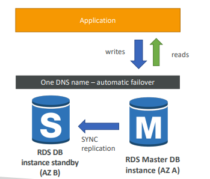

# Amazon RDS Overview

* It’s a managed DB service for DB use SQL as a query language.&#x20;
*   It allows you to create databases in the cloud that are managed by AWS.&#x20;

    * Postgres&#x20;
    * MySQL&#x20;
    * MariaDB&#x20;
    * Oracle&#x20;
    * Microsoft SQL Server&#x20;
    * Aurora (AWS Proprietary database)

## Advantage over using RDS versus deploying DB on EC2

* RDS is a managed service:&#x20;
  * Automated provisioning, OS patching&#x20;
  * Continuous backups and restore to specific timestamp (Point in Time Restore)!&#x20;
  * Monitoring dashboards • Read replicas for improved read performance&#x20;
  * Multi AZ setup for DR (Disaster Recovery)&#x20;
  * Maintenance windows for upgrades&#x20;
  * Scaling capability (vertical and horizontal)&#x20;
  * Storage backed by EBS (gp2 or io1)&#x20;
* BUT you can’t SSH into your instances

## RDS – Storage Auto Scaling&#x20;

* • Helps you increase storage on your RDS DB instance dynamically&#x20;
* When RDS detects you are running out of free database storage, it scales automatically&#x20;
* Avoid manually scaling your database storage&#x20;
* You have to set Maximum Storage Threshold (maximum limit for DB storage)&#x20;
* Automatically modify storage if:&#x20;
  * Free storage is less than 10% of allocated storage&#x20;
  * Low-storage lasts at least 5 minutes&#x20;
  * 6 hours have passed since last modification&#x20;
* Useful for applications with unpredictable workloads&#x20;
* Supports all RDS database engines (MariaDB, MySQL, PostgreSQL, SQL Server, Oracle)

## RDS Read Replicas for read scalability

* Up to 5 Read Replicas&#x20;
* Within AZ, Cross AZ or Cross Region&#x20;
* Replication is ASYNC, so reads are eventually consistent.&#x20;
* Replicas can be promoted to their own DB.
* Applications must update the connection string to leverage read replicas.
* You have a production database that is taking on normal load.&#x20;
* You want to run a reporting application to run some analytics.&#x20;
* You create a Read Replica to run the new workload there.
* The production application is unaffected.&#x20;
* Read replicas are used for SELECT (=read) only kind of statements (not INSERT, UPDATE, DELETE)

## RDS Read Replicas – Network Cost

<figure><figcaption></figcaption></figure>

## RDS Multi - AZ


Note: The Read Replicas be setup as Multi AZ for Disaster Recovery (DR)


* SYNC replication&#x20;
* One DNS name – automatic app failover to standby&#x20;
* Increase availability.&#x20;
* Failover in case of loss of AZ, loss of network, instance or storage failure&#x20;
* No manual intervention in apps&#x20;
* Not used for scaling

<figure><figcaption></figcaption></figure>

## RDS – From Single-AZ to Multi-AZ

* Zero downtime operation (no need to stop the DB)&#x20;
* Just click on “modify” for the database.
* The following happens internally:&#x20;
  * A snapshot is taken.&#x20;
  * A new DB is restored from the snapshot in a new AZ.&#x20;
  * Synchronization is established between the two databases.

<figure><figcaption></figcaption></figure>

*
